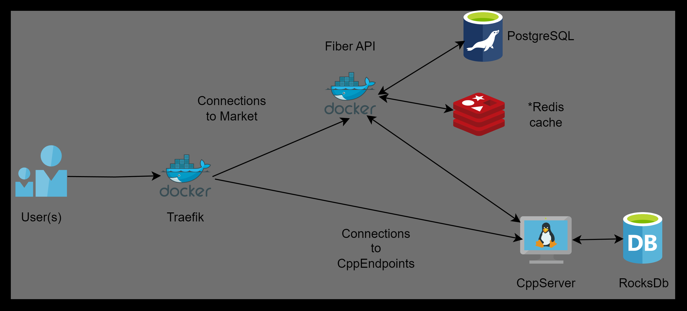

# API GO + Server C++


## 🔑 Application Description

<p align="center">
  
</p>

Development of an API to manage resources saved in the Postgres database, also connected to the C++ server that manages client requests for information using sockets + managmenet of resources using RocksDB. The C++ server also includes a Canny Edge Filter that can be applied to an image that is saved inside the server.

- **Technology Stack**:
  - **Fiber**: Utilized for creating a high-performance HTTP server.
  - **Traefik**: Used as a reverse proxy and load balancer to efficiently manage and route requests.
  - **JWT**: Ensures secure endpoint access, allowing only authenticated users to view the market.
  - **Postgres**: Utilized for robust data storage and management.

- **Endpoints**:

<details>
 <summary><code>POST</code> <code><b>/auth/register</b></code> <code>(Register a new user)</code></summary>

##### Parameters

> | name      |  type     | data type               | example                                                           |
> |-----------|-----------|-------------------------|-----------------------------------------------------------------------|
> | data      |  required | `application/json`   | `{ "username": "john_doe", "email": "john@example.com", "password": "securepassword123" }`  |


##### Responses

> | http code     | content-type                      | response                                                            |
> |---------------|-----------------------------------|---------------------------------------------------------------------|
> | `500`         | `application/json`                | `{"code":"500","message":"Bad server"}`                            |
> | `201`         | `application/json`                | `{"code":"201","message":"User added"} `                           |
> | `400`         | `application/json`                | `{"code":"400","message":"Bad request"}`                           |

##### Example httpie

> ```javascript
>  echo -n '{ "username": "john_doe", "email": "john@example.com", "password": "securepassword123" }' | http POST localhost:3000/auth/register
> ```
</details>

<details>
 <summary><code>POST</code> <code><b>/auth/login</b></code> <code>(Authenticate a user)</code></summary>

##### Parameters

> | name      |  type     | data type               | example                                                           |
> |-----------|-----------|-------------------------|-----------------------------------------------------------------------|
> | data      |  required | `application/json`   | `{ "email": "john@example.com", "password": "securepassword123" }`  |


##### Responses

> | http code     | content-type                      | response                                                            |
> |---------------|-----------------------------------|---------------------------------------------------------------------|
> | `500`         | `application/json`                | `{"code":"500","message":"Bad server"}`                            |
> | `201`         | `application/json`                | `{"code":"200","auth":"JWT"} `                                     |
> | `400`         | `application/json`                | `{"code":"400","message":"Bad request"}`                           |

##### Example httpie

> ```javascript
>  echo -n '{ "email": "john@example.com", "password": "securepassword123" }' | http POST localhost:3000/auth/register
> ```
</details>


<details>
 <summary><code>GET</code> <code><b>/auth/offers</b></code> <code>(Retrieve a list of available offers)</code></summary>

##### Parameters

> | name      |  type     | data type               | example                                                           |
> |-----------|-----------|-------------------------|-----------------------------------------------------------------------|
> | data      |  required | `application/json`   | `securityDefinitions: jwt: type: apiKey name: Authorization in: header`  |


##### Responses

> | http code     | content-type                      | response                                                            |
> |---------------|-----------------------------------|---------------------------------------------------------------------|
> | `500`         | `application/json`                | `{"code":"500","message":"Bad server"}`                            |
> | `200`         | `application/json`                | `{"code":"200",{"message":[{"id":"1","name":"meat","quantity":100,"price":10,"category":"food"},{"id":"2","name":"vegetables","quantity":200,"price":5,"category":"food"},{"id":"3","name":"fruits","quantity":150,"price":8,"category":"food"},{"id":"4","name":"water","quantity":1000,"price":2,"category":"drink"},{"id":"5","name":"antibiotics","quantity":50,"price":15,"category":"medicine"},{"id":"6","name":"analgesics","quantity":100,"price":8,"category":"medicine"},{"id":"7","name":"bandages","quantity":100,"price":5,"category":"medicine"},{"id":"8","name":"pistol ammo","quantity":200,"price":1,"category":"ammo"},{"id":"9","name":"rifle ammo","quantity":300,"price":1.5,"category":"ammo"},{"id":"10","name":"shotgun ammo","quantity":100,"price":2,"category":"ammo"}]}} `                                     |
> | `401`         | `application/json`                | `{"code":"401","message":"Unauthorized"}`                           |

##### Example httpie

> ```javascript
>  http --auth-type=jwt --auth="<token>" GET localhost:3000/auth/offers
> ```
</details>

<details>
 <summary><code>POST</code> <code><b>/auth/checkout</b></code> <code>(Buy a list of orders)</code></summary>

##### Parameters

> | name      |  type     | data type               | example                                                           |
> |-----------|-----------|-------------------------|-----------------------------------------------------------------------|
> | data      |  required | `application/json`   | `{"order":{ "id": 1, items: [{"quantity":10,"product_id":1},{"quantity":5, "product_id":4},{"quantity":3,"product_id":2}]}`  |
> | data      |  required | `application/json`   | `securityDefinitions: jwt: type: apiKey name: Authorization in: header`  |


##### Responses

> | http code     | content-type                      | response                                                            |
> |---------------|-----------------------------------|---------------------------------------------------------------------|
> | `500`         | `application/json`                | `{"code":"500","message":"Bad server"}`                             |
> | `200`         | `application/json`                | `{"code":"200",{"message":{"total":"1000","status":"pending"}`|
> | `401`         | `application/json`                | `{"code":"401","message":"Unauthorized"}`                           |

##### Example httpie

> ```javascript
>  echo -n '{"order":{ "id": 1, items: [{"quantity":10,"product_id":1},{"quantity":5, "product_id":4},{"quantity":3,"product_id":2}]}' | http --auth-type=jwt --auth="<token>" POST localhost:3000/auth/checkout
> ```
</details>

<details>
 <summary><code>GET</code> <code><b>/auth/orders/:id</b></code> <code>(Get the status of a specific order)</code></summary>

##### Parameters

> | name      |  type     | data type               | example                                                           |
> |-----------|-----------|-------------------------|-----------------------------------------------------------------------|
> | data      |  required | `application/json`   | `securityDefinitions: jwt: type: apiKey name: Authorization in: header`  |


##### Responses

> | http code     | content-type                      | response                                                            |
> |---------------|-----------------------------------|---------------------------------------------------------------------|
> | `500`         | `application/json`                | `{"code":"500","message":"Bad server"}`                             |
> | `200`         | `application/json`                | `{"code":"200",{"message":{"status":{ "preparing/processing/shipped/delivered"}`|
> | `401`         | `application/json`                | `{"code":"401","message":"Unauthorized"}`                           |

##### Example httpie

> ```javascript
>  http --auth-type=jwt --auth="<token>" GET localhost:3000/auth/orders/1
> ```
</details>

<details>
 <summary><code>GET</code> <code><b>/admin/dashboard</b></code> <code>(Get status of all market)</code></summary>

##### Parameters

> | name      |  type     | data type               | example                                                           |
> |-----------|-----------|-------------------------|-----------------------------------------------------------------------|
> | data      |  required | `application/json`   | `securityDefinitions: jwt: type: apiKey name: Authorization in: header role: Admin`  |


##### Responses

> | http code     | content-type                      | response                                                            |
> |---------------|-----------------------------------|---------------------------------------------------------------------|
> | `500`         | `application/json`                | `{"code":"500","message":"Bad server"}`                             |
> | `200`         | `application/json`                | `{"code":"200",{"message":{ "offers": [ {"id": "1", "name": "meat", "quantity": 100, "price": 10, "category": "food"}, {"id": "2", "name": "vegetables", "quantity": 200, "price": 5, "category": "food"}, {"id": "3", "name": "fruits", "quantity": 150, "price": 8, "category": "food"}, {"id": "4", "name": "water", "quantity": 1000, "price": 2, "category": "drink"}, {"id": "5", "name": "antibiotics", "quantity": 50, "price": 15, "category": "medicine"}, {"id": "6", "name": "analgesics", "quantity": 100, "price": 8, "category": "medicine"}, {"id": "7", "name": "bandages", "quantity": 100, "price": 5, "category": "medicine"}, {"id": "8", "name": "pistol ammo", "quantity": 200, "price": 1, "category": "ammo"}, {"id": "9", "name": "rifle ammo", "quantity": 300, "price": 1.5, "category": "ammo"}, {"id": "10", "name": "shotgun ammo", "quantity": 100, "price": 2, "category": "ammo"} ], "orders": [ {"id": "1", "status": "pending", "total": 1000}, {"id": "2", "status": "pending", "total": 1000}, {"id": "3", "status": "processing", "total": 1000}, {"id": "4", "status": "shipped", "total": 1000}, {"id": "5", "status": "delivered", "total": 1000} ], "balance": 5000 }`|
> | `401`         | `application/json`                | `{"code":"401","message":"Unauthorized"}`                           |

##### Example httpie

> ```javascript
>  http --auth-type=jwt --auth="<token>" GET localhost:3000/admin/dashboard
> ```
</details>

<details>
 <summary><code>PATCH</code> <code><b>/admin/orders/:id</b></code> <code>(Update the status of a specific order)</code></summary>

##### Parameters

> | name      |  type     | data type               | example                                                           |
> |-----------|-----------|-------------------------|-----------------------------------------------------------------------|
> | data      |  required | `application/json`   | `{"status":{ "preparing/processing/shipped/delivered" }`  |
> | data      |  required | `application/json`   | `securityDefinitions: jwt: type: apiKey name: Authorization in: header role: Admin`  |


##### Responses

> | http code     | content-type                      | response                                                            |
> |---------------|-----------------------------------|---------------------------------------------------------------------|
> | `500`         | `application/json`                | `{"code":"500","message":"Bad server"}`                             |
> | `200`         | `application/json`                | `{"code":"200",{"message":{"status":{ "preparing/processing/shipped/delivered"}`|
> | `401`         | `application/json`                | `{"code":"401","message":"Unauthorized"}`                           |

##### Example httpie

> ```javascript
>  echo -n '{"status":{ "preparing/processing/shipped/delivered"}' | http --auth-type=jwt --auth="<token>" PATCH localhost:3000/auth/orders/1
> ```
</details>

##### Responses

> | http code     | content-type                      | response                                                            |
> |---------------|-----------------------------------|---------------------------------------------------------------------|
> | `500`         | `application/json`                | `{"code":"500","message":"Bad server"}`                             |
> | `200`         | `application/json`                | `{"code":"200",{"message":[{ "username": "john_doe", "email": "john@example.com"},...] } `|
> | `401`         | `application/json`                | `{"code":"401","message":"Unauthorized"}`                           |

</details>

<details>
 <summary><code>DELETE</code> <code><b>/admin/users/</b></code> <code>(Remove an customer)</code></summary>

  ##### Parameters

> | name      |  type     | data type               | example                                                           |
> |-----------|-----------|-------------------------|-----------------------------------------------------------------------|
> | data      |  required | `application/json`   | `{"user": [ 1, 5 ] }`  |
> | data      |  required | `application/json`   | `securityDefinitions: jwt: type: apiKey name: Authorization in: header role: Admin`  |


##### Responses

> | http code     | content-type                      | response                                                            |
> |---------------|-----------------------------------|---------------------------------------------------------------------|
> | `500`         | `application/json`                | `{"code":"500","message":"Bad server"}`                             |
> | `200`         | `application/json`                | `{"code":"200",{"message":"success" } `|
> | `401`         | `application/json`                | `{"code":"401","message":"Unauthorized"}`                           |
</details>
